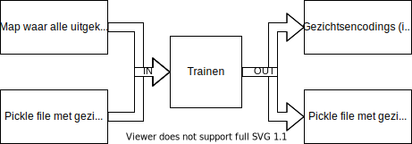

# Python OOP Project 3 Modene Aanwezigheidslijst

Deze repo bevat klasses om een moderne aanwezigheidslijst op te stellen aan de hand van gezichtsherkenning.

Bibliotheken: `PyQt6`, `dlib` `matplotlib`, `face_recognition`, `numpy`, `pickle`

`programma2.py` is een PyQt6 GUI-applicatie waarin de werking wordt gedemonstreerd. HEt herkenningsproces bestaat uit 3
onderdelen.

1. Uitknippen
2. Trainen
3. Oplijsten


## Uitknippen


- `findFiles` vindt de ondersteunde afbeelding bestanden in een meegegeven map.
- `cropFaces` knip de gevonden gezichten uit naar een meegegeven map.

De map met alle uitgesneden gezichten zal manueel moeten verdeeld worden in submappen die de persoon beschrijven.

```
├── Ada
│   └── 111.jpg
├── Arthur
│   ├── 101.jpg
│   └── 116.jpg
└── Thomas
    ├── 102.jpg
    └── 112.jpg
```

## Trainen



- `train` zal in de meegegeven map de mappen scannen op afbeeldingen met gezichten en daar de encodings van opslaan in
  een lijst samen met de naam van de persoon.
- `export_faces` zal een .pickle bestand maken om later te kunnen importeren.
- `import_faces` kan een .pickle bestand importeren om te gebruiken.

De import en export functionaliteit bespaart veel tijd en rekenkracht omdat je niet telkens opnieuw moet trainen op de
gezichten.

## Oplijsten


- `get_list` zal een aanwezigheidslijst genereren in CSV formaat.
- `draw_rect` zal een afbeelding maken waar alle herkende gezichten omcirkeld zijn met naam erbij.
- `get_list_draw_rect` combineert `get_list` en `draw_rect`
